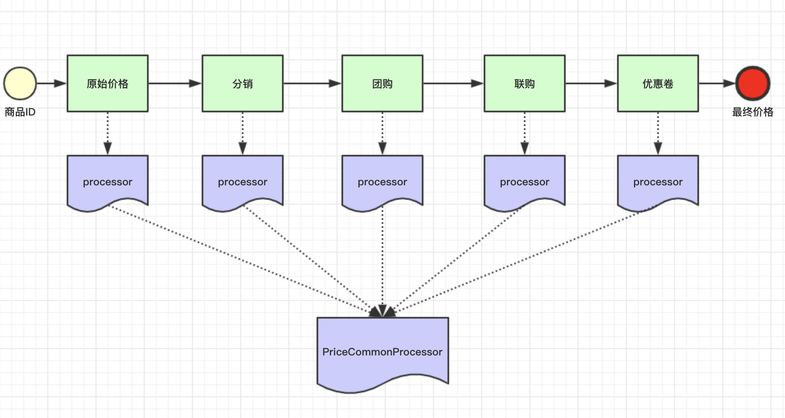

# Spring @Autowired 注入到List和Map


## 需求

!!! note "需求"

    对商品进行价格计算，计算价格设计到到元素是不固定到。有到商品涉及到优惠卷有到商品涉及到团购，有到商品全都涉及到。

    每一个环节计算完成以后，要把价格传递给下一个环节接着计算。


{++  抽象出一个模型就是流水线pipeline，一个阶段一个阶段处理，上一个阶段处理完成以后传递给下一个阶段 ++}




## Spring实现pipeline

!!! question "实现方式"

    Spring 使用 `@Autowired` + `@Order` 实现同一类型的实例注入到集合（List or Map）
  
```java tab="定义类型接口"

public interface PriceCommonProcessor {
	
	
	
	public Integer process(Integer lastPrice);

}

```

```java tab="A阶段"
import org.springframework.core.annotation.Order;
import org.springframework.stereotype.Component;

import lombok.extern.slf4j.Slf4j;

@Component
@Order(1)
@Slf4j
public class A_Processor implements PriceCommonProcessor{

	@Override
	public Integer process(Integer lastPrice) {
		log.info("A >>>> processor");
		return lastPrice - 100;
	}

}
```

```java tab="B阶段"
import org.springframework.core.annotation.Order;
import org.springframework.stereotype.Component;

import lombok.extern.slf4j.Slf4j;

@Component
@Order(2)
@Slf4j
public class B_Processor implements PriceCommonProcessor {

	@Override
	public Integer process(Integer lastPrice) {
		log.info("B >>>> processor");
		return lastPrice - 200;
	}

}
```

```java tab="C阶段"
import org.springframework.core.annotation.Order;
import org.springframework.stereotype.Component;

import lombok.extern.slf4j.Slf4j;

@Component
@Order(3)
@Slf4j
public class C_Processor implements PriceCommonProcessor{

	@Override
	public Integer process(Integer lastPrice) {
		log.info("C >>>> processor");
		return lastPrice - 300;
		
	}

}


```

```java tab="使用及测试"

import java.util.List;

import org.springframework.beans.factory.annotation.Autowired;
import org.springframework.web.bind.annotation.GetMapping;
import org.springframework.web.bind.annotation.RestController;

import com.example.demo.processor.PriceCommonProcessor;

@RestController
public class TestController {
	
	@Autowired
	private List<PriceCommonProcessor> list;
	
	@GetMapping("dd")
	public Integer getPrice(Integer lastPrice) {
		
		for (PriceCommonProcessor processor : list) {
			lastPrice = processor.process(lastPrice);
		}
		
		return lastPrice;
		
	}

}


```

执行命令`$ curl 'localhost:8080/dd?lastPrice=1000'`

!!! info "控制台日志输出"

    - A >>>> processor
    - B >>>> processor
    - C >>>> processor


{++


1. `@Autowired` 可以直接注入同一type的实例到list，注入的顺序就是被`@Order`标记到顺序，从而形成pipeline模型
2. 不仅可以顺序注入到`List`， 还可以注入到`Map`

++}


```java


import java.util.List;
import java.util.Map;

import org.springframework.beans.factory.annotation.Autowired;
import org.springframework.web.bind.annotation.GetMapping;
import org.springframework.web.bind.annotation.RestController;

import com.example.demo.processor.PriceCommonProcessor;

import lombok.extern.slf4j.Slf4j;

@RestController
@Slf4j
public class TestController {
	
	@Autowired
	private List<PriceCommonProcessor> list;
	
	@Autowired
	private Map<String, PriceCommonProcessor> map;
	
	@GetMapping("dd")
	public Integer getPrice(Integer lastPrice) {
		
		map.entrySet().forEach(e -> {
			log.info("{}--->>{}", e.getKey(), e.getValue().getClass().getName() );
		});
		return 1;
		
	}

}


```


{==


- a_Processor--->>com.example.demo.processor.A_Processor
- b_Processor--->>com.example.demo.processor.B_Processor
- c_Processor--->>com.example.demo.processor.C_Processor

==}


