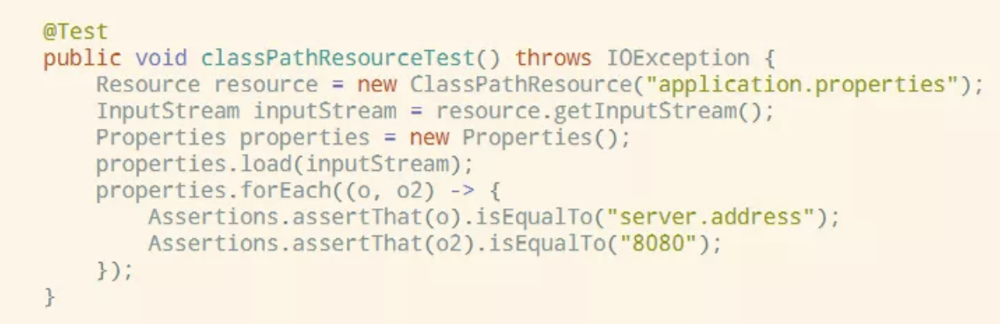
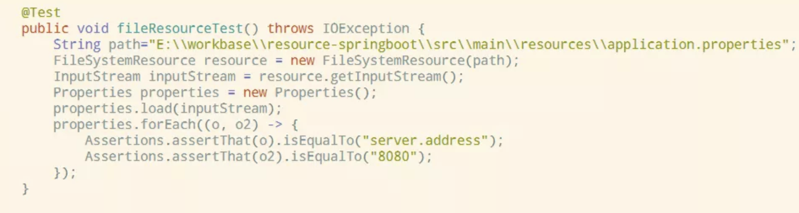
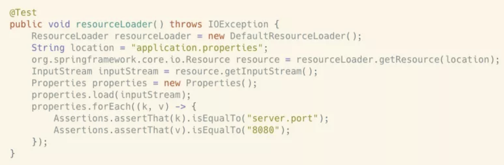
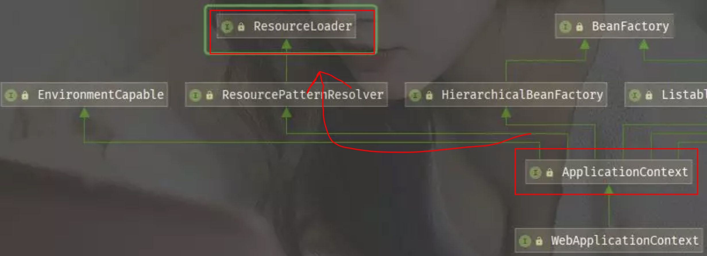
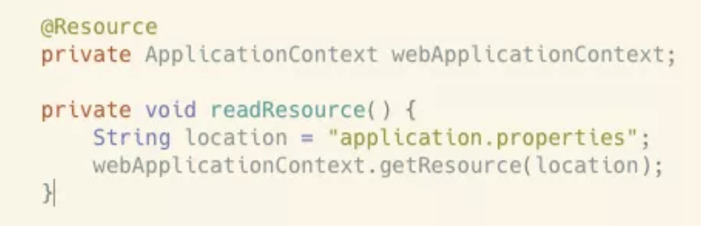
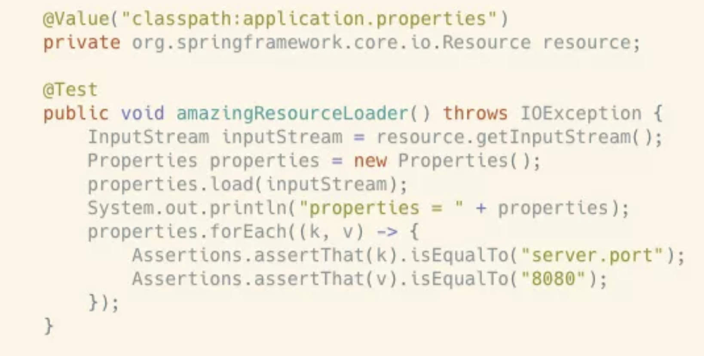
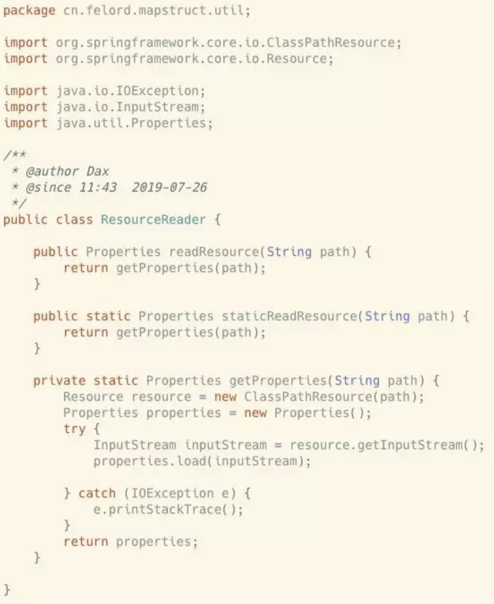
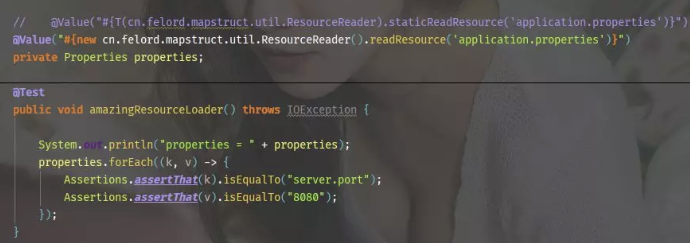

# 老司机教你通过Spring来读取文件的各种姿势

## 1. 概述

在日常业务开发中我们经常有可能读取一些自定义配置或者文件。比如说公私钥文件、一些固定的词典文件之类的，这一类统称为资源（Resource）。很多情况下都是自己写IO来读取。今天开始你可以不用再自己造轮子了。因为Spring自带有资源加载功能，甚至还有非常便利的方法将读取的内容注入Spring bean。接下来我们就来见识一下吧。

## 2. 通过Resource接口

我们可以使用org.springframework.core.io.Resource接口简化资源文件的定位。Spring帮助我们使用资源加载器查找和读取资源，资源加载器根据提供的路径决定选择哪个Resource实现。

### 2.1 使用Resource的实现类

org.springframework.core.io.Resource接口常用的有两个实现类：

1. org.springframework.core.io.ClassPathResource 用来加载classpath下的资源，我们直接读取springboot 配置文件 application.properties,其中已经写入了一个配置 server.port=8080

2. org.springframework.core.io.FileSystemResource  用来加载系统文件，通常通过文件的绝对或者相对路径来读取。上面的例子我们用这个来试一试。不同的是这次我们需要文件的路径。 

### 2.2 使用ResourceLoader

如果你业务中需要使用延迟加载，我们可以使用类ResourceLoader：

我们也可以使用@Autowired将ResourceLoader注入我们的bean ：

根据上图ApplicationContext 继承了ResourceLoader 接口。因此我们可以通过Spring bean 注入的方式来读取资源。

这种使用方式看上去更Spring，接着往下看，还有更Spring的骚操作。

### 2.3 使用@Value注解

我们直接使用@Value注解将资源直接注入Spring bean。还有这种操作！不行了！我已经迫不及待的要写几行试试了：

完美无暇！断言全部正确！不知道能不能读取图片。我想也是可以的，这个留给你自己发掘。但是就这么结束了吗？玩一个刺激点的。为什么不直接解析出来并注入对象呢？SpEL(Spring Expression Language)可以做到这一点。让我们来见识一下吧。

### 2.4 使用SpEL直接解析

为了展现灵活性，这里我们定义自己的解析类。我们定义了一个读取配置文件的工具类  cn.felord.mapstruct.util.ResourceReader

两个方法都是一样的效果，但是要展现的是不同途径。下面的代码必须让它的出场与众不同：

被注释掉的代码同样管用，你很容易观察到它们之间的差别。

## 3. 总结

经过上面的讲解，我们了解了Spring去处理资源文件的各种姿势。甚至还有直接获取并装配资源的方法。相信看了本文之后你会立即抛掉以前的老套做法。赶紧给码农小胖哥点个赞吧。

