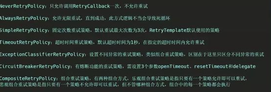

# 【最佳实践】程序员如何优雅的进行重试

## 1. 说明


最近公司在搞活动，需要依赖一个第三方接口，测试阶段并没有什么异常状况，但上线后发现依赖的接口有时候会因为内部错误而返回系统异常，虽然概率不大，但总因为这个而报警总是不好的，何况死信队列的消息还需要麻烦运维进行重新投递，所以加上重试机制势在必行。

重试机制可以保护系统减少因网络波动、依赖服务短暂性不可用带来的影响，让系统能更稳定的运行的一种保护机制。让你原本就稳如狗的系统更是稳上加稳。


为了方便说明，先假设我们想要进行重试的方法如下：


```java


import java.time.LocalTime;
import java.util.concurrent.atomic.AtomicLong;

import org.springframework.stereotype.Service;

import lombok.extern.slf4j.Slf4j;

@Service
@Slf4j
public class HelloService {
	
	private static AtomicLong helloTimes = new AtomicLong();
	
	public String hello() throws Exception {
		long times = helloTimes.getAndIncrement();
		if(times % 4 != 0) {
			log.warn("发生异常, time: {}", LocalTime.now());
			throw new Exception("发生hello异常");
			
		}
		return "hello";
	}
	

}


```
也就是说，这个接口每调4次才会成功一次。

## 2. 手动重试

先来用最硬核也是最简单的方法，直接在调用的时候进重试：

```java
public String getPrice(Integer lastPrice) throws Exception {
		int maxRetryTimes = 4;
		String s = "";
		for (int i = 1; i <= maxRetryTimes; i++) {
			try {
				s = helloService.hello();
				log.info("helloService返回:{}",  s);
				return s;
			} catch (Exception e) {
				log.info("helloService.hello()调用失败，准备重试");
			}
		}
		
		throw new Exception("重试次数耗尽");
		
	}

```


```log
发生异常, time: 13:53:40.841
helloService.hello()调用失败，准备重试
发生异常, time: 13:53:40.841
helloService.hello()调用失败，准备重试
发生异常, time: 13:53:40.842
helloService.hello()调用失败，准备重试
helloService返回:hello
```
程序在极短的时间内进行了4次重试，然后成功返回。

这样虽然看起来可以解决问题，但实践上，由于没有重试间隔，很可能当时依赖的服务尚未从网络异常中恢复过来，所以极有可能接下来的几次调用都是失败的。

而且，这样需要对代码进行大量的侵入式修改，显然，不优雅。


## 3. 代理模式

上面的处理方式由于需要对业务代码进行大量修改，虽然实现了功能，但是对原有代码的侵入性太强，可维护性差。

所以需要使用一种更优雅一点的方式，不直接修改业务代码，那要怎么做呢？

其实很简单，直接在业务代码的外面再包一层就行了，代理模式在这里就有用武之地了。

```java

import org.springframework.beans.factory.annotation.Autowired;
import org.springframework.stereotype.Service;

import lombok.extern.slf4j.Slf4j;

@Service
@Slf4j
public class HelloTetryProxyService {
	
	
	@Autowired
	private HelloService helloService;
	
	public String hello() throws Exception {
		
		
		int maxRetryTimes = 4;
		String s = "";
		for (int retry = 1; retry <= maxRetryTimes; retry++) {
			try {
				s = helloService.hello();
				log.info("helloService返回:{}", s);
				return s;
			} catch (Exception e) {
				log.info("helloService.hello()调用失败, 准备重试");
			}
			
		}
		
		throw new Exception("重试次数耗尽");
		
	}

}

```
这样，重试逻辑就都由代理类来完成，原业务类的逻辑就不需要修改了，以后想修改重试逻辑也只需要修改这个类就行了，分工明确。比如，现在想要在重试之间加上一个延迟，只需要做一点点修改即可：


```java
	public String hello() throws Exception {
		
		
		int maxRetryTimes = 4;
		String s = "";
		for (int retry = 1; retry <= maxRetryTimes; retry++) {
			try {
				s = helloService.hello();
				log.info("helloService返回:{}", s);
				return s;
			} catch (Exception e) {
				log.info("helloService.hello()调用失败, 准备重试");
			}
			
			try {
				Thread.sleep(1000);
			} catch (Exception e) {
				e.printStackTrace();
			}
			
		}
		
		throw new Exception("重试次数耗尽");
		
	}
```

代理模式虽然要更加优雅，但是如果依赖的服务很多的时候，要为每个服务都创建一个代理类，显然过于麻烦，而且其实重试的逻辑都大同小异，无非就是重试的次数和延时不一样而已。如果每个类都写这么一长串类似的代码，显然，不优雅！


## 4. JDK动态代理

这时候，动态代理就闪亮登场了。只需要写一个代理处理类，就可以开局一条狗，砍到九十九。

```java tab="接口"

public interface IService {
	
	
	
	public String hello() throws Exception;

}

```

```java tab="实现类"

import java.time.LocalTime;
import java.util.concurrent.atomic.AtomicLong;

import org.springframework.stereotype.Service;

import lombok.extern.slf4j.Slf4j;

@Service
@Slf4j
public class HelloService implements IService{
	
	private static AtomicLong helloTimes = new AtomicLong();
	
	@Override
	public String hello() throws Exception {
		
		long times = helloTimes.getAndIncrement();
		if(times % 4 != 0) {
			log.warn("发生异常, time: {}", LocalTime.now());
			throw new Exception("发生hello异常");
			
		}
		return "hello";
	}
	

}


```

```java tab="jdk动态代理"


import java.lang.reflect.InvocationHandler;
import java.lang.reflect.Method;
import java.lang.reflect.Proxy;
import java.time.LocalTime;

import lombok.extern.slf4j.Slf4j;

@Slf4j
public class RetryInvocationHandler implements InvocationHandler {
	
	private final Object subject;
	
	
	public RetryInvocationHandler(Object subject) {
		this.subject = subject;
	}

	@Override
	public Object invoke(Object proxy, Method method, Object[] args) throws Throwable {
		
		int times = 0;
		while (times <= 4) {
			try {
				return method.invoke(subject, args);
			} catch (Exception e) {
				times++;
				log.info("times:{},time:{}", times, LocalTime.now());
				if (times > 4) {
					throw new Exception(e);
				}
			}
			
			Thread.sleep(1000);//延时1s
			
			
		}
		return null;
		
		
	}
	/**
	 * 获取动态代理
	 * @param realSubject
	 * @return
	 */
	public static Object getProxy(Object realSubject) {
		InvocationHandler handler = new RetryInvocationHandler(realSubject);
		return Proxy.newProxyInstance(handler.getClass().getClassLoader(), realSubject.getClass().getInterfaces(), handler);
	}
	

}


```
来一发单元测：

```java

@GetMapping("dd")
	public String getPrice(Integer lastPrice) throws Exception {
		HelloService helloService = new HelloService();
		IService proxyService = (IService) RetryInvocationHandler.getProxy(helloService);
		String hello = proxyService.hello();
		log.info("hello:{}", hello);
		return hello;
		
	}

```


```log

发生异常, time: 14:51:39.167
times:1,time:14:51:39.167
发生异常, time: 14:51:40.172
times:2,time:14:51:40.172
发生异常, time: 14:51:41.176
times:3,time:14:51:41.177
hello:hello

```


在重试了4次之后输出了Hello，符合预期。

动态代理可以将重试逻辑都放到一块，显然比直接使用代理类要方便很多，也更加优雅。

不过不要高兴的太早，这里因为被代理的HelloService是一个简单的类，没有依赖其它类，所以直接创建是没有问题的，但如果被代理的类依赖了其它被Spring容器管理的类，则这种方式会抛出异常，因为没有把被依赖的实例注入到创建的代理实例中。

这种情况下，就比较复杂了，需要从Spring容器中获取已经装配好的，需要被代理的实例，然后为其创建代理类实例，并交给Spring容器来管理，这样就不用每次都重新创建新的代理类实例了。

话不多说，撸起袖子就是干。


[头条原文](https://www.toutiao.com/a6729261849436504584/?tt_from=weixin&utm_campaign=client_share&wxshare_count=1&timestamp=1566870815&app=news_article&utm_source=weixin&utm_medium=toutiao_android&req_id=20190827095335049007048006D52E1CDE&group_id=6729261849436504584)


## 5. cglib


## 6. Spring AOP

想要无侵入式的修改原有逻辑？想要一个注解就实现重试？用Spring AOP不就能完美实现吗？使用AOP来为目标调用设置切面，即可在目标方法调用前后添加一些额外的逻辑。

先创建一个注解：

```java

import java.lang.annotation.Documented;
import java.lang.annotation.ElementType;
import java.lang.annotation.Retention;
import java.lang.annotation.RetentionPolicy;
import java.lang.annotation.Target;

@Target(ElementType.METHOD)
@Retention(RetentionPolicy.RUNTIME)
@Documented
public @interface Retryable {
	
	int retryTimes() default 3;
	int retryInterval() default 1;

}
```
有两个参数，retryTimes 代表最大重试次数，retryInterval代表重试间隔。

然后在需要重试的方法上加上注解：


```java


import java.time.LocalTime;
import java.util.concurrent.atomic.AtomicLong;

import org.springframework.stereotype.Service;

import com.example.demo.anno.Retryable;

import lombok.extern.slf4j.Slf4j;

@Service
@Slf4j
public class HelloService {
	
	private static AtomicLong helloTimes = new AtomicLong();
	
	@Retryable(retryTimes = 4, retryInterval = 2)
	public String hello() throws Exception {
		
		long times = helloTimes.getAndIncrement();
		if(times % 4 != 0) {
			log.warn("发生异常, time: {}", LocalTime.now());
			throw new Exception("发生hello异常");
			
		}
		return "hello";
	}
	

}

```

接着，进行最后一步，编写AOP切面

```java


import org.aspectj.lang.ProceedingJoinPoint;
import org.aspectj.lang.annotation.Around;
import org.aspectj.lang.annotation.Aspect;
import org.aspectj.lang.annotation.Pointcut;
import org.aspectj.lang.reflect.MethodSignature;
import org.springframework.stereotype.Component;

import com.example.demo.anno.Retryable;

import lombok.extern.slf4j.Slf4j;

@Component
@Slf4j
@Aspect
public class RetryAspect {

	
	
	@Pointcut("@annotation(com.example.demo.anno.Retryable)")
	private void retryMethodCall() {}
	
	@Around("retryMethodCall()")
	public Object retry(ProceedingJoinPoint joinPoint) throws Exception {
		
		Retryable retryable = ((MethodSignature)joinPoint.getSignature()).getMethod().getAnnotation(Retryable.class);
		int retryInterval = retryable.retryInterval();
		int maxRetryTimes = retryable.retryTimes();
		Throwable error = new RuntimeException();
		for(int retryTimes = 1; retryTimes <= maxRetryTimes; retryTimes++ ) {
			try {
				Object result = joinPoint.proceed();
				return result;
			} catch (Throwable e) {
				error = e;
				log.warn("调用发生异常，开始重试。retryTimes:{}", retryTimes);
			}
			Thread.sleep(retryInterval * 1000);
		}
		
		throw new Exception("重试次数耗尽", error);
		
		
	}
	
	
}

```


开始测试：


```java

@Autowired
	private HelloService helloService;
	
	
	
	
	@GetMapping("dd")
	public String getPrice(Integer lastPrice) throws Exception {
		
		return helloService.hello();
	}

```

```log

 Completed initialization in 7 ms
 发生异常, time: 16:36:15.416
 调用发生异常，开始重试。retryTimes:1
 发生异常, time: 16:36:17.421
 调用发生异常，开始重试。retryTimes:2
 发生异常, time: 16:36:19.427
 调用发生异常，开始重试。retryTimes:3
```


这样就相当优雅了，一个注解就能搞定重试，简直不要更棒。


## 7. Spring 的重试注解

实际上Spring中就有比较完善的重试机制，比上面的切面更加好用，还不需要自己动手重新造轮子。

那让我们先来看看这个轮子究竟好不好使。

先引入重试所需的jar包

```xml

<dependency>
  <groupId>org.springframework.boot</groupId>
  <artifactId>spring-boot-starter-aop</artifactId>
</dependency>
<dependency>
  <groupId>org.springframework.retry</groupId>
  <artifactId>spring-retry</artifactId>
</dependency>
```

然后在启动类或者配置类上添加@EnableRetry注解，接下来在需要重试的方法上添加@Retryable注解（嗯？好像跟我自定义的注解一样？竟然抄袭我的注解

```java

import java.time.LocalTime;
import java.util.concurrent.atomic.AtomicLong;

import org.springframework.retry.annotation.Backoff;
import org.springframework.retry.annotation.Retryable;
import org.springframework.stereotype.Service;

import lombok.extern.slf4j.Slf4j;

@Service
@Slf4j
public class HelloService {
	
	private static AtomicLong helloTimes = new AtomicLong();
	@Retryable(maxAttempts = 5, backoff = @Backoff(delay = 1000, multiplier = 2))
	public String hello() throws Exception {
		
		long times = helloTimes.getAndIncrement();
		if(times % 4 != 0) {
			log.warn("发生异常, time: {}", LocalTime.now());
			throw new Exception("发生hello异常");
			
		}
		return "hello";
	}
	

}

```

默认情况下，会重试三次，重试间隔为1秒。当然我们也可以自定义重试次数和间隔。这样就跟我前面实现的功能是一毛一样的了。

但Spring里的重试机制还支持很多很有用的特性，比如说，可以指定只对特定类型的异常进行重试，这样如果抛出的是其它类型的异常则不会进行重试，就可以对重试进行更细粒度的控制。默认为空，会对所有异常都重试。

也可以使用include和exclude来指定包含或者排除哪些异常进行重试。

可以用maxAttemps指定最大重试次数，默认为3次。

可以用interceptor设置重试拦截器的bean名称。

可以通过label设置该重试的唯一标志，用于统计输出。

可以使用exceptionExpression来添加异常表达式，在抛出异常后执行，以判断后续是否进行重试。

此外，Spring中的重试机制还支持使用backoff来设置重试补偿机制，可以设置重试间隔，并且支持设置重试延迟倍数。

举个例子：


该方法调用将会在抛出HelloRetryException异常后进行重试，最大重试次数为5，第一次重试间隔为1s，之后以2倍大小进行递增，第二次重试间隔为2s，第三次为4s，第四次为8s。

重试机制还支持使用@Recover 注解来进行善后工作，当重试达到指定次数之后，将会调用该方法，可以在该方法中进行日志记录等操作。

这里值得注意的是，想要@Recover 注解生效的话，需要跟被@Retryable 标记的方法在同一个类中，且被@Retryable 标记的方法不能有返回值，否则不会生效。

并且如果使用了@Recover注解的话，重试次数达到最大次数后，如果在@Recover标记的方法中无异常抛出，是不会抛出原异常的


除了使用注解外，Spring Retry 也支持直接在调用时使用代码进行重试：


此时唯一的好处是可以设置多种重试策略：




可以看出，Spring中的重试机制还是相当完善的，比上面自己写的AOP切面功能更加强大。

这里还需要再提醒的一点是，由于Spring Retry用到了Aspect增强，所以就会有使用Aspect不可避免的坑——方法内部调用，如果被 @Retryable 注解的方法的调用方和被调用方处于同一个类中，那么重试将会失效。

但也还是存在一定的不足，Spring的重试机制只支持对异常进行捕获，而无法对返回值进行校验。

可以看出，Spring中的重试机制还是相当完善的，比上面自己写的AOP切面功能更加强大。

这里还需要再提醒的一点是，由于Spring Retry用到了Aspect增强，所以就会有使用Aspect不可避免的坑——方法内部调用，如果被 @Retryable 注解的方法的调用方和被调用方处于同一个类中，那么重试将会失效。

但也还是存在一定的不足，Spring的重试机制只支持对异常进行捕获，而无法对返回值进行校验。


## 8. Guava Retry

最后，再介绍另一个重试利器——Guava Retry。

相比Spring Retry，Guava Retry具有更强的灵活性，可以根据返回值校验来判断是否需要进行重试。

先来看一个小栗子：

先引入jar包：

```xml
<dependency>
			<groupId>com.github.rholder</groupId>
			<artifactId>guava-retrying</artifactId>
			<version>2.0.0</version>
		</dependency>
```
然后用一个小Demo来感受一下：

```java

Retryer<String> retryer = RetryerBuilder.<String>newBuilder()
				.retryIfExceptionOfType(Exception.class)
				.retryIfResult(StringUtils::isEmpty)
				.withWaitStrategy(WaitStrategies.fixedWait(3, TimeUnit.SECONDS))
				.withStopStrategy(StopStrategies.stopAfterAttempt(3))
				.build();
				
		
		return retryer.call(()->helloService.hello());
```

先创建一个Retryer实例，然后使用这个实例对需要重试的方法进行调用，可以通过很多方法来设置重试机制，比如使用retryIfException来对所有异常进行重试，使用retryIfExceptionOfType方法来设置对指定异常进行重试，使用retryIfResult来对不符合预期的返回结果进行重试，使用retryIfRuntimeException方法来对所有RuntimeException进行重试。

还有五个以with开头的方法，用来对重试策略/等待策略/阻塞策略/单次任务执行时间限制/自定义监听器进行设置，以实现更加强大的异常处理。

通过跟Spring AOP的结合，可以实现比Spring Retry更加强大的重试功能。

仔细对比之下，Guava Retry可以提供的特性有：

可以设置任务单次执行的时间限制，如果超时则抛出异常。
可以设置重试监听器，用来执行额外的处理工作。
可以设置任务阻塞策略，即可以设置当前重试完成，下次重试开始前的这段时间做什么事情。
可以通过停止重试策略和等待策略结合使用来设置更加灵活的策略，比如指数等待时长并最多10次调用，随机等待时长并永不停止等等。


## 9. 总结

本文由浅入深的对多种重试的姿势进行了360度无死角教学，从最简单的手动重试，到使用静态代理，再到JDK动态代理和CGLib动态代理，再到Spring AOP，都是手工造轮子的过程，最后介绍了两种目前比较好用的轮子，一个是Spring Retry，使用起来简单粗暴，与Spring框架天生搭配，一个注解搞定所有事情，另一个便是Guava Retry，不依赖于Spring框架，自成体系，使用起来更加灵活强大。

个人认为，大部分场景下，Spring Retry提供的重试机制已经足够强大，如果不需要Guava Retry提供的额外灵活性，使用Spring Retry就很棒了。当然，具体情况具体分析，但没有必要的情况下，不鼓励重复造轮子，先把别人的轮子研究清楚再想想还用不用自己动手。

本文到此就告一段落了，又用了一天的时间完成了完成了一篇文章，写作的目的在于总结和分享，我相信最佳实践是可以总结和积累下来的，在大多数场景下都是适用的，这些最佳实践会在逐渐的积累过程中，成为比经验更为重要的东西。因为经验不总结就会忘记，而总结出来的内容却不会被丢失。


