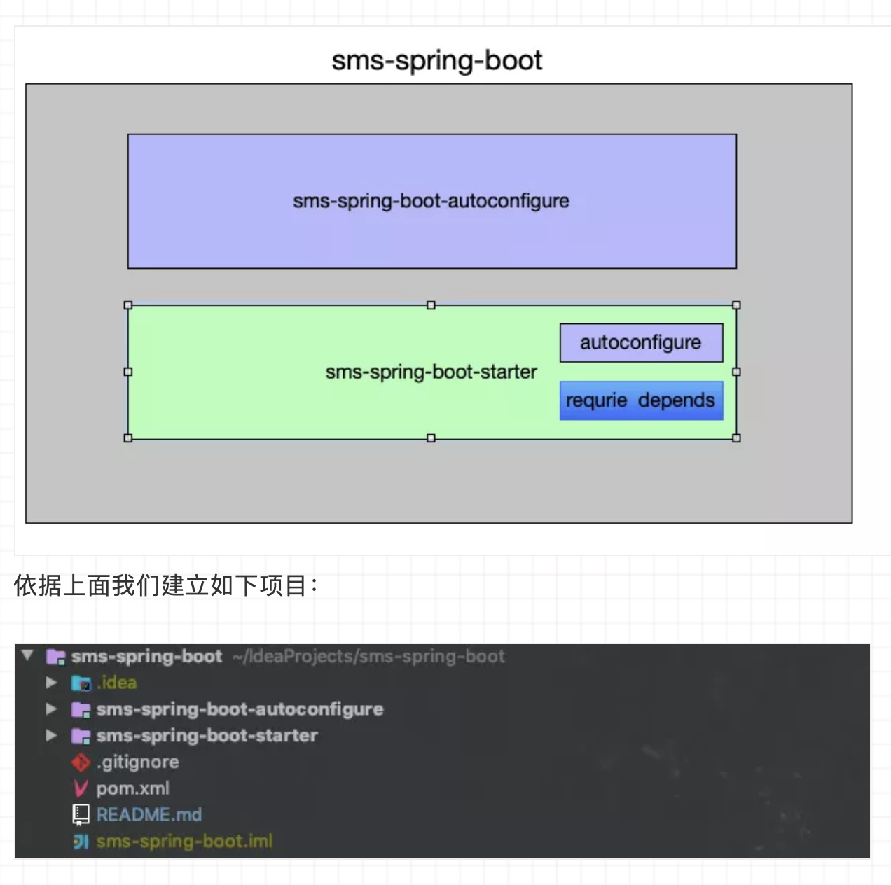

## 1. 前言

随着Spring的日渐臃肿，为了简化配置、开箱即用、快速集成，Spring Boot 横空出世。目前已经成为 Java 目前最火热的框架了。平常我们用Spring Boot开发web应用。Spring mvc 默认使用tomcat servlet容器， 因为Spring mvc组件集成了spring-boot-starter-tomcat 。但是现在undertow servlet容器的性能非常好。我们可以通过以下方式先排除tomcat：

```xml
<dependency>
	<groupId>org.springframework.boot</groupId>
	<artifactId>spring-boot-starter-web</artifactId>
	<exclusions>
		<exclusion>
			<groupId>org.springframework.boot</groupId>
			<artifactId>spring-boot-starter-tomcat</artifactId>
		</exclusion>
	</exclusions>
</dependency>

```

然后直接替换为undertow:


```xml
<dependency>
	<groupId>org.springframework.boot</groupId>
	<artifactId>spring-boot-starter-undertow</artifactId>
</dependency>
```

代码无需更改。这就是组件化后的好处：1.可插拔。2.可定制。3.按需集成。为什么能够做到快速适配？我们试想一个这样一个场景：假如你的汽车轮子上有个螺丝坏了，你要买一个螺丝去自己装。你去店里只要报上你汽车的品牌和位置老板就能准确地知道你要用哪种螺丝。这就是标准已经制定好的好处。如果没有标准，你很容易买到不配套的螺丝，你要不停的试错。这显然不是你想要的。如果把这种标准潜移默化，那么我们在沟通上就更加快捷方便。有时候你女朋友一个眼神你就知道她想要干什么。所以Spring Boot 有一个“约定大于配置”的规则，让程序组件之间来减少配置，降低复杂性。因此你在开发一个自定义的Spring Boot Starter的时候也最好考虑你的starter如何达到以上的便利性。

一个组件的设计一定要有标准和规则。Spring Boot Starter也不例外。我们来看看一些常规的做法。

## 2. spring boot 的一些约定

一个组件的设计一定要有标准和规则。Spring Boot Starter也不例外。我们来看看一些常规的做法。


### 2.1 命名风格

如果你快有孩子了，出生前你比较急的一定是起个名字。姓名标识着你和你爱人的血统，一定不会起隔壁老王的姓氏，肯定会招来异样的眼光。在maven中，groupId代表着姓氏，artifactId代表着名字。Spring Boot也是有一个命名的建议的。groupId不要用官方的org.springframework.boot

而要用你自己独特的。对于artifactId的命名，Spring Boot官方建议非官方的Starter命名格式遵循 xxxx-spring-boot-starter ，例如 mybatis-spring-boot-starter 。官方starter会遵循spring-boot-starter-xxxx ,例如上面提到的spring-boot-starter-undertow 。很多开源starter作者会忽略这种约定，显得不够“专业“。


## 3. 自定义一个Starter


接下来我们构建一个自定义的第三方短信starter，命名为sms-spring-boot-starter 。有一些细节问题需要边写边来介绍。下面是一个省略了samples和test模块模版：




### 3.1 sms-spring-boot

sms-spring-boot构建一个项目重要的就是依赖管理。所以引入BOM是必要的。主要管理该starter的所有模块module，以及starter的所有依赖甚至sms-spring-boot-autoconfigure都由sms-spring-boot管理。


### 3.2 autoconfigure

该模块主要用来定义配置参数、以及自动配置对外暴露的功能（一般是抽象的接口Spring Bean）。


#### 3.2.1 Properties配置

一般配置参数都是在Spring Boot 的application.yml中。我们会定义一个前缀标识来作为名称空间隔离各个组件的参数。对应的组件会定义一个XXXXProperties 来自动装配这些参数。自动装配的机制基于@ConfigurationProperties注解，请注意一定要显式声明你配置的前缀标识（prefix）。我们的sms-spring-boot会作如下配置：


```java
import lombok.Data;
import org.springframework.boot.context.properties.ConfigurationProperties;


/**
 * 短信配置类
 *
 * @author Dax
 * @since 10 :10  2019-04-03
 */
@ConfigurationProperties(prefix = SmsProperties.SMS_PREFIX)
@Data
public class SmsProperties {

    /**
     *  sms prefix.
     */
    static final String SMS_PREFIX = "sms";
    private Aliyun aliyun;

    /**
     * sms switch  production is set to true, development set to false
     */
    private boolean enabled;

    /**
     *  aliyun  sms config.
     */
    @Data
    public static class Aliyun {
        /**
         * aliyun sms sign name must not be null
         */
        private String signName;
        /**
         * aliyun sms access key
         */
        private String accessKeyId;
        /**
         * aliyun sms access key secret
         */
        private String accessKeySecret;

    }

}
```
以上以阿里云的短信功能为例作配置，在将来使用时只需要在application.yml中加入上面对应SmsProperties的配置：


```yaml
sms:
  enabled: true
  aliyun:
    access-key-id:
    access-key-secret:
    sign-name:
```

如果你集成了Spring Boot 校验库 你也可以对SmsProperties进行校验。在配置application.yml时细心的java开发者会发现参数配置都有像下面一样的参数描述:

就像java中的注释一样方便我们理解该配置的作用，其实这个就是java注释生成的。你需要依赖

```xml
 <dependency>
    <groupId>org.springframework.boot</groupId>
    <artifactId>spring-boot-autoconfigure</artifactId>
    <optional>true</optional>
</dependency>
```


然后就该依赖会对SmsProperties 成员属性的注释进行提取生成一个spring-configuration-metadata.json文件，这就是配置描述的元数据文件。Spring Boot官方也对注释进行了一些规则约束：

 

- 不要以“The”或“A”开头描述。
- 对于boolean类型，请使用“Whether" 或“Enable”开始描述。
- 对于基于集合的类型，请使用“Comma-separated list”
- 如果默认时间单位不等同于毫秒，则使用java.time.Duration而不是long描述默认单位，例如“如果未指定持续时间后缀，则将使用秒”。
- 除非必须在运行时确定，否则不要在描述中提供默认值。
- 补充我个人建议描述尽量使用英文描述。


#### 3.2.2 配置自动暴露功能接口

拿到配置后，接下来就是根据配置来初始化我们的功能接口，我们会抽象一个短信发送接口SmsSender，根据短信提供方的SDK来进行功能设计。请注意autoconfigure模块的依赖几乎都是不可传递的。也就是依赖坐标配置optional为true 。功能接口实现完后我们会编写一个自动配置类 SmsAutoConfiguration 。除了@Configuration注解外，@ConfigurationProperties会帮助我们将我们的配置类

SmsProperties加载进来。然后将我们需要暴露的功能接口声明为Spring Bean 暴露给Spring Boot应用 。


有时候我们还可以通过一些条件来控制SmsAutoConfiguration或者SmsSender ，比如根据某个条件是否加载或加载不同的

SmsSender。有时间你可以看看redis-starter就能很明显感觉到，它会根据luttuce、redisson、jedis 的变化实例化不同的客户端链接。实现方式是使用了@Conditional系列注解，有时间可以学习一下该系列的注解。好了我们的SmsAutoConfiguration声明如下：


```java

import cn.felord.boot.sms.autoconfigure.core.AliSmsSender;
import cn.felord.boot.sms.autoconfigure.core.SmsProperties;
import cn.felord.boot.sms.autoconfigure.core.SmsSender;
import org.springframework.boot.autoconfigure.condition.ConditionalOnProperty;
import org.springframework.boot.context.properties.EnableConfigurationProperties;
import org.springframework.context.annotation.Bean;
import org.springframework.context.annotation.Configuration;

/**
 * The type Sms configuration.
 *
 * @author Dax
 * @since 11 :34  2019-04-03
 */
@Configuration
@EnableConfigurationProperties(SmsProperties.class)
public class SmsAutoConfiguration {
    /**
     * Sms sender sms sender.
     *
     * @param smsProperties the sms properties
     * @return the sms sender
     */
    @Bean
    @ConditionalOnProperty(prefix = "sms.aliyun",name = "sign-name",matchIfMissing = false)
    public SmsSender aliyunSmsSender(SmsProperties smsProperties) {
        SmsProperties.Aliyun aliyun = smsProperties.getAliyun();
        return new AliSmsSender(smsProperties.isEnabled(), aliyun.getSignName(), aliyun.getAccessKeyId(), aliyun.getAccessKeySecret());
    }
}
```


#### 3.2.3 主动生效和被动生效

starter集成入应用有两种方式。我们从应用视角来看有两种：

一种是主动生效，在starter组件集成入Spring Boot应用时需要你主动声明启用该starter才生效，即使你配置完全。这里会用到@Import注解，将该注解标记到你自定义的@Enable注解上：

```java
import cn.felord.boot.sms.autoconfigure.SmsAutoConfiguration;
import org.springframework.context.annotation.Import;

import java.lang.annotation.*;

/**
 * 启用短信息配置
 *
 * @author Dax
 * @since 16:03  2019-05-15
 */
@Target(ElementType.TYPE)
@Retention(RetentionPolicy.RUNTIME)
@Documented
@Import(SmsAutoConfiguration.class)
public @interface EnableSMS {
}
```


我们将该注解标记入Spring Boot应用就可以使用短信功能了。

另一种被动生效，在starter组件集成入Spring Boot应用时就已经被应用捕捉到。这里会用到类似java的SPI机制。在autoconfigure资源包下新建META-INF/spring.factories写入SmsAutoConfiguration全限定名。

```
org.springframework.boot.autoconfigure.EnableAutoConfiguration=\
cn.felord.boot.sms.autoconfigure
```

多个配置类逗号隔开，换行使用反斜杠。


### 3.3 sms-spring-boot-starter

该模块是一个空jar。它唯一目的是提供必要的依赖项来使用starter。你可以认为它就是集成该starter功能的唯一入口。不要对添加启动器的项目做出假设。如果您自动配置的依赖库通常需要其他启动器，请同时提及它们。如果可选依赖项的数量很高，则提供一组适当的默认依赖项可能很难，因为您应该避免包含对典型库的使用不必要的依赖项。换句话说，您不应该包含可选的依赖项。


无论哪种方式，您的starter必须直接或间接引用核心Spring Boot启动器（spring-boot-starter）（如果您的启动器依赖于另一个启动器，则无需添加它）。如果只使用自定义启动器创建项目，则Spring Boot的核心功能将通过核心启动器的存在来实现。

我们的sms-spring-boot-starter仅仅是以下的pom：

```xml tab="parent"
<?xml version="1.0" encoding="UTF-8"?>
<project xmlns="http://maven.apache.org/POM/4.0.0"
         xmlns:xsi="http://www.w3.org/2001/XMLSchema-instance"
         xsi:schemaLocation="http://maven.apache.org/POM/4.0.0 http://maven.apache.org/xsd/maven-4.0.0.xsd">
    <modelVersion>4.0.0</modelVersion>

    <groupId>cn.felord.boot</groupId>
    <artifactId>sms-spring-boot</artifactId>
    <version>1.0.0.RELEASE</version>
    <modules>
        <module>sms-spring-boot-autoconfigure</module>
        <module>sms-spring-boot-starter</module>
    </modules>
    <packaging>pom</packaging>


    <properties>
        <java.version>1.8</java.version>
        <spring-boot.version>2.1.7.RELEASE</spring-boot.version>
        <aliyun-sms.version>1.1.0</aliyun-sms.version>
        <aliyun-sdk.version>4.3.8</aliyun-sdk.version>
        <lombok.version>1.18.8</lombok.version>
        <sms-starter.version>1.0.0.RELEASE</sms-starter.version>
    </properties>


    <dependencyManagement>
        <dependencies>
            <dependency>
                <groupId>org.springframework.boot</groupId>
                <artifactId>spring-boot-starter</artifactId>
                <version>${spring-boot.version}</version>
            </dependency>
            <dependency>
                <groupId>org.springframework.boot</groupId>
                <artifactId>spring-boot-autoconfigure</artifactId>
                <version>${spring-boot.version}</version>
            </dependency>
            <dependency>
                <groupId>org.springframework.boot</groupId>
                <artifactId>spring-boot-configuration-processor</artifactId>
                <version>${spring-boot.version}</version>
            </dependency>
            <dependency>
                <groupId>com.aliyun</groupId>
                <artifactId>aliyun-java-sdk-dysmsapi</artifactId>
                <version>${aliyun-sms.version}</version>
            </dependency>
            <dependency>
                <groupId>com.aliyun</groupId>
                <artifactId>aliyun-java-sdk-core</artifactId>
                <version>${aliyun-sdk.version}</version>
            </dependency>
            <dependency>
                <groupId>org.projectlombok</groupId>
                <artifactId>lombok</artifactId>
                <version>${lombok.version}</version>
            </dependency>
            <dependency>
                <groupId>org.springframework.boot</groupId>
                <artifactId>spring-boot-starter-logging</artifactId>
                <version>${spring-boot.version}</version>
            </dependency>
            <dependency>
                <groupId>cn.felord.boot</groupId>
                <artifactId>sms-spring-boot-autoconfigure</artifactId>
                <version>${sms-starter.version}</version>
            </dependency>
        </dependencies>
    </dependencyManagement>
</project>

```


```xml tab="sms-spring-boot-starter"
<?xml version="1.0" encoding="UTF-8"?>
<project xmlns="http://maven.apache.org/POM/4.0.0"
         xmlns:xsi="http://www.w3.org/2001/XMLSchema-instance"
         xsi:schemaLocation="http://maven.apache.org/POM/4.0.0 http://maven.apache.org/xsd/maven-4.0.0.xsd">

    <modelVersion>4.0.0</modelVersion>
    <groupId>cn.felord.boot</groupId>
    <artifactId>sms-spring-boot-starter</artifactId>
    <version>1.0.0.RELEASE</version>

    <dependencyManagement>
        <dependencies>
            <dependency>
                <groupId>cn.felord.boot</groupId>
                <artifactId>sms-spring-boot</artifactId>
                <version>1.0.0.RELEASE</version>
                <type>pom</type>
                <scope>import</scope>
            </dependency>
        </dependencies>
    </dependencyManagement>

    <dependencies>
        <dependency>
            <groupId>org.springframework.boot</groupId>
            <artifactId>spring-boot-starter</artifactId>
        </dependency>
        <dependency>
            <groupId>cn.felord.boot</groupId>
            <artifactId>sms-spring-boot-autoconfigure</artifactId>
        </dependency>
        <dependency>
            <groupId>com.aliyun</groupId>
            <artifactId>aliyun-java-sdk-dysmsapi</artifactId>
        </dependency>
        <dependency>
            <groupId>com.aliyun</groupId>
            <artifactId>aliyun-java-sdk-core</artifactId>
        </dependency>
    </dependencies>
</project>
```

```xml tab="sms-spring-boot-autoconfigure"
<?xml version="1.0" encoding="UTF-8"?>
<project xmlns="http://maven.apache.org/POM/4.0.0"
         xmlns:xsi="http://www.w3.org/2001/XMLSchema-instance"
         xsi:schemaLocation="http://maven.apache.org/POM/4.0.0 http://maven.apache.org/xsd/maven-4.0.0.xsd">

    <modelVersion>4.0.0</modelVersion>
    <groupId>cn.felord.boot</groupId>
    <artifactId>sms-spring-boot-autoconfigure</artifactId>
    <version>1.0.0.RELEASE</version>
    <packaging>jar</packaging>

    <dependencyManagement>
        <dependencies>
            <dependency>
                <groupId>cn.felord.boot</groupId>
                <artifactId>sms-spring-boot</artifactId>
                <version>1.0.0.RELEASE</version>
                <type>pom</type>
                <scope>import</scope>
            </dependency>
        </dependencies>
    </dependencyManagement>


    <dependencies>
        <dependency>
            <groupId>org.springframework.boot</groupId>
            <artifactId>spring-boot-autoconfigure</artifactId>
            <optional>true</optional>
        </dependency>
        <dependency>
            <groupId>org.springframework.boot</groupId>
            <artifactId>spring-boot-configuration-processor</artifactId>
            <optional>true</optional>
        </dependency>
        <dependency>
            <groupId>com.aliyun</groupId>
            <artifactId>aliyun-java-sdk-dysmsapi</artifactId>
            <optional>true</optional>
        </dependency>
        <dependency>
            <groupId>com.aliyun</groupId>
            <artifactId>aliyun-java-sdk-core</artifactId>
            <optional>true</optional>
        </dependency>
        <dependency>
            <groupId>org.projectlombok</groupId>
            <artifactId>lombok</artifactId>
            <scope>compile</scope>
        </dependency>
        <dependency>
            <groupId>org.springframework.boot</groupId>
            <artifactId>spring-boot-starter-logging</artifactId>
            <scope>provided</scope>
        </dependency>
    </dependencies>


</project>

```


到此为止，我们的整个短信Starter就开发完成了。

## 4. 总结

自定义starter对于我们项目组件化、模块化是有很大帮助的。同时也是Spring Boot一大特色。相信通过小胖的介绍你已经蠢蠢欲试了，那么就赶紧开始写一个吧。如果觉得对你有用可以点个赞关注一下。

sms-spring-boot-starter 已经上传到码云仓库，该项目稍加修改就可以使用到生产。

地址：https://gitee.com/felord/sms-spring-boot.git


