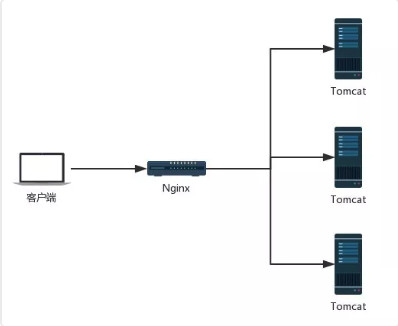
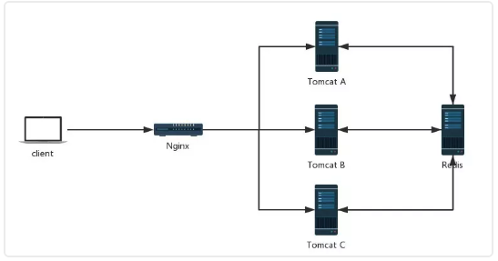
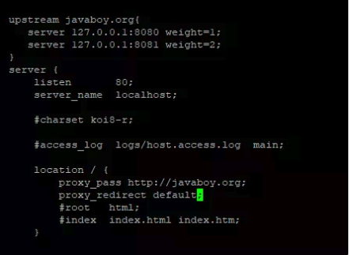

有的人可能会觉得题目有点夸张，其实不夸张，题目没有使用任何修辞手法！认真读完本文，你就知道松哥说的是对的了！

在传统的单服务架构中，一般来说，只有一个服务器，那么不存在 Session 共享问题，但是在分布式/集群项目中，Session 共享则是一个必须面对的问题，先看一个简单的架构图：



在这样的架构中，会出现一些单服务中不存在的问题，例如客户端发起一个请求，这个请求到达 Nginx 上之后，被 Nginx 转发到 Tomcat A 上，然后在 Tomcat A 上往 session 中保存了一份数据，下次又来一个请求，这个请求被转发到 Tomcat B 上，此时再去 Session 中获取数据，发现没有之前的数据。对于这一类问题的解决，思路很简单，就是将各个服务之间需要共享的数据，保存到一个公共的地方__（主流方案就是 Redis）__：

:heart: :thumbsup:



当所有 Tomcat 需要往 Session 中写数据时，都往 Redis 中写，当所有 Tomcat 需要读数据时，都从 Redis 中读。这样，不同的服务就可以使用相同的 Session 数据了。

这样的方案，可以由开发者手动实现，即手动往 Redis 中存储数据，手动从 Redis 中读取数据，相当于使用一些 Redis 客户端工具来实现这样的功能，毫无疑问，手动实现工作量还是蛮大的。

一个简化的方案就是使用 Spring Session 来实现这一功能，Spring Session 就是使用 Spring 中的代理过滤器，将所有的 Session 操作拦截下来，自动的将数据 同步到 Redis 中，或者自动的从 Redis 中读取数据。

对于开发者来说，所有关于 Session 同步的操作都是透明的，开发者使用 Spring Session，一旦配置完成后，具体的用法就像使用一个普通的 Session 一样。


## 1. 实战

### 1.1 创建工程

首先 创建一个 Spring Boot 工程，引入 Web、Spring Session 以及 Redis:

```xml tab="pom.xml"

<dependencies>
    <dependency>
        <groupId>org.springframework.boot</groupId>
        <artifactId>spring-boot-starter-data-redis</artifactId>
    </dependency>
    <dependency>
        <groupId>org.springframework.boot</groupId>
        <artifactId>spring-boot-starter-web</artifactId>
    </dependency>
    <dependency>
        <groupId>org.springframework.session</groupId>
        <artifactId>spring-session-data-redis</artifactId>
    </dependency>
</dependencies>


```

!!! danger "注意"

    这里我使用的 Spring Boot 版本是 2.1.4 ，如果使用当前最新版 Spring Boot2.1.5 的话，除了上面这些依赖之外，需要额外添加 Spring Security 依赖（其他操作不受影响，仅仅只是多了一个依赖，当然也多了 Spring Security 的一些默认认证流程）。

### 1.2 配置 Redis

```properties tab="application.properties"

spring.redis.host=192.168.66.128 
spring.redis.port=6379
spring.redis.password=123
spring.redis.database=0
```

这里的 Redis ，我虽然配置了四行，但是考虑到端口默认就是 6379 ，database 默认就是 0，所以真正要配置的，其实就是两行。


### 1.3 使用

配置完成后 ，就可以使用 Spring Session 了，其实就是使用普通的 HttpSession ，其他的 Session 同步到 Redis 等操作，框架已经自动帮你完成了：

```java

import java.util.List;
import java.util.Map;
import java.util.Set;
import java.util.StringJoiner;

import javax.servlet.http.HttpSession;

import org.springframework.beans.factory.annotation.Autowired;
import org.springframework.beans.factory.annotation.Value;
import org.springframework.web.bind.annotation.GetMapping;
import org.springframework.web.bind.annotation.RestController;

import com.example.demo.processor.PriceCommonProcessor;

import lombok.extern.slf4j.Slf4j;

@RestController
@Slf4j
public class TestController {
	
	
	
	@Value("${server.port}")
	Integer port;
	
	
	@GetMapping("set")
	public String set(HttpSession session) {
		session.setAttribute("user", "wms");
		return String.valueOf(port);
	}
	

}


```

考虑到一会 Spring Boot 将以集群的方式启动 ，为了获取每一个请求到底是哪一个 Spring Boot 提供的服务，需要在每次请求时返回当前服务的端口号，因此这里我注入了 server.port 。

### 1.4 引入nginx



```conf

upstream bigbay-h5-payment {
  ip_hash;
  server 192.168.5.203:8887;
  server 192.168.0.71:8887;
}


server {
    listen 80;
    server_name bigbay-h5.qingclass.com;

    location / {
      proxy_pass http://bigbay-h5-payment;
      proxy_set_header Host $host;
      proxy_set_header X-Real-IP $remote_addr;
      proxy_set_header X-Forwarded-For $proxy_add_x_forwarded_for;
      keepalive_timeout 3000;
      proxy_connect_timeout 3000;
      proxy_read_timeout 3000;
      proxy_redirect default;
    }
}

```


在这段配置中：

- upstream 表示配置上游服务器
- javaboy.org 表示服务器集群的名字，这个可以随意取名字
- upstream 里边配置的是一个个的单独服务
- weight 表示服务的权重，意味者将有多少比例的请求从 Nginx 上转发到该服务上
- location 中的 proxy_pass 表示请求转发的地址， / 表示拦截到所有的请求，转发转发到刚刚配置好的服务集群中
- proxy_redirect 表示设置当发生重定向请求时，nginx 自动修正响应头数据（默认是 Tomcat 返回重定向，此时重定向的地址是 Tomcat 的地址，我们需要将之修改使之成为 Nginx 的地址）。


配置完成后，将本地的 Spring Boot 打包好的 jar 上传到 Linux ，然后在 Linux 上分别启动两个 Spring Boot 实例：

```bash
nohup java -jar sessionshare-0.0.1-SNAPSHOT.jar --server.port=8080 > catalina.out  2>&1 &
nohup java -jar sessionshare-0.0.1-SNAPSHOT.jar --server.port=8081 > catalina.out  2>&1 &
```

其中

1. nohup 表示当终端关闭时，Spring Boot 不要停止运行
2. & 表示让 Spring Boot 在后台启动
3. 2>&1 输出所有的日志文件

配置完成后，重启 Nginx

```bash
nginx - s reload
```

## 2. 总结

本文主要向大家介绍了 Spring Session 的使用，另外也涉及到一些 Nginx 的使用 ，虽然本文较长，但是实际上 Spring Session 的配置没啥。

我们写了一些代码，也做了一些配置，但是全都和 Spring Session 无关，配置是配置 Redis，代码就是普通的 HttpSession，和 Spring Session 没有任何关系！

唯一和 Spring Session 相关的，可能就是我在一开始引入了 Spring Session 的依赖吧！

如果大家没有在 SSM 架构中用过 Spring Session ，可能不太好理解我们在 Spring Boot 中使用 Spring Session 有多么方便，因为在 SSM 架构中，Spring Session 的使用要配置三个地方 ，一个是 web.xml 配置代理过滤器，然后在 Spring 容器中配置 Redis，最后再配置 Spring Session，步骤还是有些繁琐的，而 Spring Boot 中直接帮我们省去了这些繁琐的步骤！不用再去配置 Spring Session。


